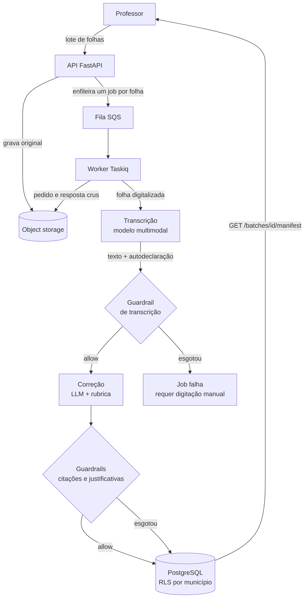

# Arquitetura

## O diagrama

**A camada de entrada** é uma API FastAPI com onze rotas. Ela recebe o lote,
grava cada folha no object storage, cria as entidades de domínio e enfileira
um job por folha. Ela não fala com nenhum modelo — a requisição do professor
termina assim que o trabalho está enfileirado.

**A camada de processamento** é um worker Taskiq consumindo de uma fila SQS.
É onde as chamadas aos modelos acontecem e onde os guardrails atuam.

**A camada de persistência** tem duas metades. O PostgreSQL guarda o domínio
e o histórico de tentativas, com isolamento por município aplicado no próprio
banco. O object storage guarda o que é grande e imutável: a folha original e o
registro cru de cada conversa com o modelo.

## Por que assíncrono

Uma correção leva mediana de 37,8 segundos e chega a 154, e a transcrição de
uma folha leva outros 11,7 segundos na mediana (lotes `e4d508d6`, `7c7c395b`, `f6dd1865` e `cda91f62`, 2026-09-20,
deepseek-v4.1-flash, 478 correções e 94 transcrições). Um lote aceita até 50
folhas.

Prender uma requisição HTTP por esse tempo não é viável, e multiplicar isso
por 50 folhas numa única requisição é menos ainda. O professor envia o lote,
recebe os identificadores dos jobs e consulta o resultado depois.

Isso também é o que permite retentar: um job que falha por instabilidade do
provedor volta para a fila sem que ninguém precise reenviar a folha.

## Por que RLS e não filtro na aplicação

O isolamento entre municípios é política de linha no PostgreSQL — cada tabela
do domínio tem `ENABLE ROW LEVEL SECURITY` mais `FORCE ROW LEVEL SECURITY`, e
a política compara `municipio_id` com um parâmetro de sessão definido pela
dependência que abre a conexão.

A alternativa seria filtrar por município em cada consulta da aplicação. A
diferença aparece no erro: com filtro na aplicação, uma consulta em que
alguém esqueceu o `WHERE` vaza dado de outro município e nada avisa. Com RLS
e `FORCE`, a mesma consulta simplesmente não retorna as linhas — nem para o
dono da tabela.

Num sistema que guarda redação de criança com o nome do aluno na folha, o
modo de falha importa mais que a elegância.

O efeito é visível no manifesto: pedir o lote de outro município responde 404,
não 403. A diferença é deliberada — 403 confirmaria que o recurso existe.

## A camada de provedores

Todo acesso a modelo passa por uma abstração fina sobre a biblioteca
pydantic-ai. Dois registros de provedores existem: um para correção, com
`mock` e `openrouter`, e um para transcrição, com `mock` e `vision`.

Isso serve a dois propósitos concretos. Trocar de modelo é configuração, não
código — o que um trabalho que precisa comparar modelos não pode dispensar. E
o provedor `mock` permite que a suíte de testes exercite o pipeline inteiro
sem gastar dinheiro nem depender de rede, o que é o que torna viável ter
testes de verdade sobre o caminho de correção.

O que o sistema fala de fato com os modelos está em [OpenRouter](openrouter.md).

## Como gerar a figura da monografia

O diagrama acima é a fonte. Para a versão impressa, importe o mesmo texto
Mermaid no [diagrams.net](https://www.drawio.com/docs/reference/diagram-generation/),
que o converte em formas editáveis, e ajuste ali o que precisar.

A versão polida é artefato de publicação e não volta para o repositório. O
Mermaid continua sendo a fonte, versionada junto do código que ele descreve —
é o que evita a figura publicada e o sistema divergirem em silêncio.
