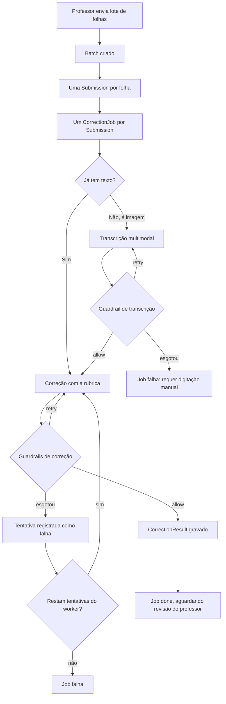

# Processo de correção

## O fluxo

## As quatro entidades, e por que são quatro

**Batch** agrupa um envio. É o que o professor manda de uma vez e o que ele
exporta depois como manifesto.

**Submission** é uma folha. Guarda a referência da imagem original e, depois
da transcrição, o texto e o rastro de quanto custou obtê-lo.

**CorrectionJob** é a unidade de trabalho assíncrono. Tem estado
(`pending`, `processing`, `done`, `failed`) e um orçamento de tentativas,
que nasce em três.

**CorrectionAttempt** é uma tentativa. Existem várias por job de propósito:
a rastreabilidade exige o histórico, não só o desfecho. Uma tentativa guarda
o modelo, as versões de prompt e rubrica, os parâmetros de inferência, os
tokens, o custo, o provedor que serviu e os vereditos dos guardrails.

O resultado aceito vive numa entidade separada, **CorrectionResult**, com
restrição de unicidade por job — um job tem no máximo um resultado, mesmo que
tenha tido várias tentativas.

## A topologia de retry em dois níveis

Esta é a decisão menos óbvia do sistema, e entendê-la é o que permite ler os
dados corretamente.

Existem dois tipos de falha, e eles são tratados em lugares diferentes.

**Falha de conteúdo** é quando o modelo respondeu, mas a resposta não se
sustenta: citou um trecho que não está na redação, repetiu a mesma
justificativa em critérios diferentes, entregou uma transcrição que o próprio
modelo declara incompleta. Isso é tratado **por dentro** da execução, pelo
guardrail. O retry carrega o histórico da conversa e a instrução do guard,
então o modelo vê o que errou em vez de tentar de novo às cegas. Esse retry
é contado em `model_retries`.

**Falha de infraestrutura** é rede, provedor fora do ar, tempo esgotado.
Isso é tratado **por fora**, pelo laço do worker, e cada volta gera uma linha
nova em `correction_attempts` com `attempt_number` incrementado.

As duas contagens medem coisas diferentes e **não devem ser somadas**.
`model_retries` conta chamadas ao modelo dentro de uma tentativa;
`attempt_number` conta tentativas dentro de um job.

A divisão tem uma razão prática. O retry informado é barato: reaproveita o
contexto e diz ao modelo o que corrigir. O retry externo é caro: refaz tudo
do zero, sem histórico, pagando o prompt inteiro de novo. Usar o caro para
resolver problema de conteúdo seria desperdício; usar o barato para resolver
queda de rede não funcionaria, porque não há conversa para continuar.

## Como isso aparece na prática

No experimento de confiabilidade (lotes `e4d508d6`, `7c7c395b`, `f6dd1865` e
`cda91f62`, 2026-09-20, deepseek-v4.1-flash), 462 dos 470 jobs acertaram na
primeira tentativa. Os outros oito esgotaram o orçamento interno do guardrail
— o modelo insistiu em saída que não passava — e foram recuperados pelo laço
externo numa segunda tentativa, que passou.

Essas oito tentativas esgotadas registraram de 6.953 a 9.304 tokens de entrada,
com mediana de US$ 0,0023 e US$ 0,0201 somados. Todas as oito consumiram os
dois retries internos antes de desistir. Não foram gratuitas, e a tabela de
auditoria mostra isso: uma tentativa que falha depois de três chamadas ao
modelo gravou o que essas três chamadas custaram.
